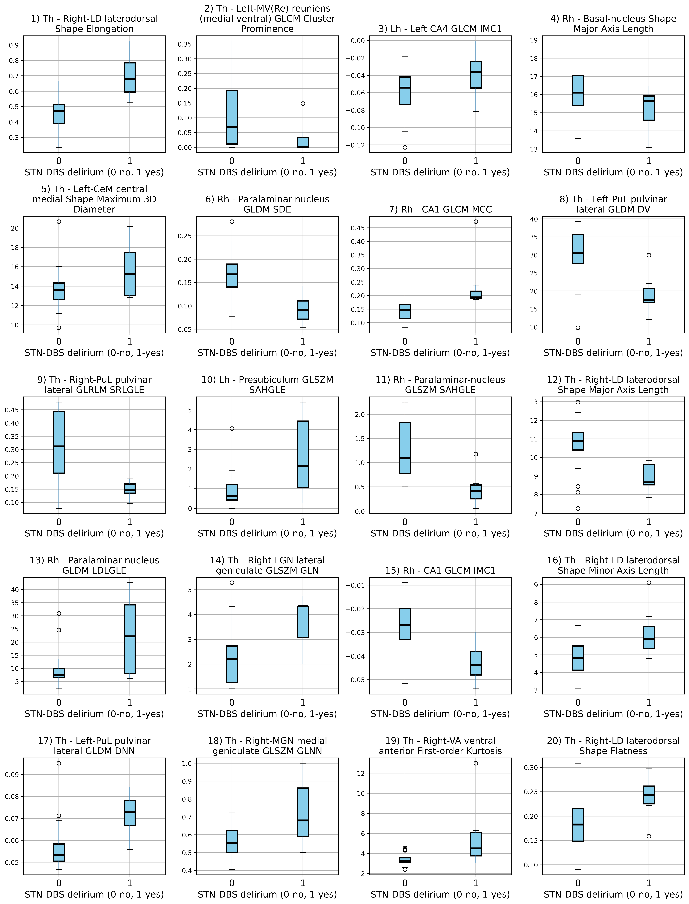
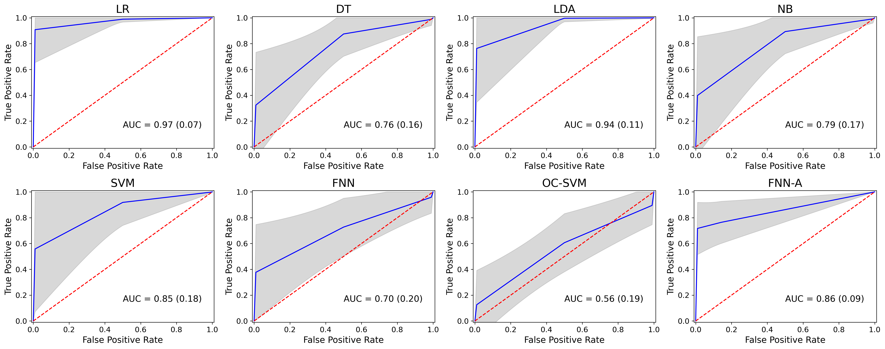

# Machine Learning-Driven Radiomic Profiling of Thalamus-Amygdala Nuclei for Prediction of Postoperative Delirium after STN-DBS in Parkinson's Disease Patients

Radziunas A. et al. 2024

The goal of the study is to predict the subthalamic nucleus (STN) deep brain stimulation (DBS) outcomes for Parkinson’s disease (PD) patients using the selected radiomic features extracted from pre-operative magnetic resonance images. Minimum Redundancy Maximum Relevance (mRMR) feature selection method was used to select the most relevant features out of 9125 total radiomic features. The resulting 20 features were used to discriminate the patients into two classes of no postoperative STN-DBS delirium vs postoperative STN-DBS delirium using statistical and machine learning algorithms.

The codes provided implement 8 statistical and machine learning algorithms for postoperative STN-DBS delirium prediction together with the accuracy visualization. 

## Prerequisites

The code was developed and tested on Windows with Python 3.7.  
Install required libraries:
```
pip install -r requirements.txt
```

## Usage

### 1. DBS outcome prediction

''prediction_STN_DBS_delirium.py'' will run 8 statistical and machine learning algorithms to discriminate between no postoperative STN-DBS delirium vs postoperative STN-DBS delirium:

```
0 - Binary Logistic Regression
1 - Linear Discriminant Analysis
2 - Naive Bayes Classifier
3 - Decision Tree Classifier
4 - Support Vector Machine
5 - Artificial Neural Network
6 - One Class Support Vector Machine
7 - Autoencoder
```

### 2. Data visualization 

''Fig2_radiomic_features_boxplots.py'' will show the boxplots of the selected radiomic features in two classes: no postoperative STN-DBS delirium vs postoperative STN-DBS delirium:



''Fig3_radiomic_features_correlations.py'' will present Spearman correlation coefficients between the selected radiomic features:


Need to run [DBS outcome prediction](#1-dbs-outcome-prediction) before this:

''Fig4_ROC.py'' will plot ROC of 8 statistical and machine learning algorithms for STN-DBS delirium prediction:
(figures/Fig4_ROC_10_features.png)(figures/Fig4_ROC_20_features.png) 

## References
Article under revision:  
Radziunas A. et al. "Machine Learning-Driven Radiomic Profiling of Thalamus-Amygdala Nuclei for Prediction of Postoperative Delirium after STN-DBS in Parkinson's Disease Patients.", 2024

